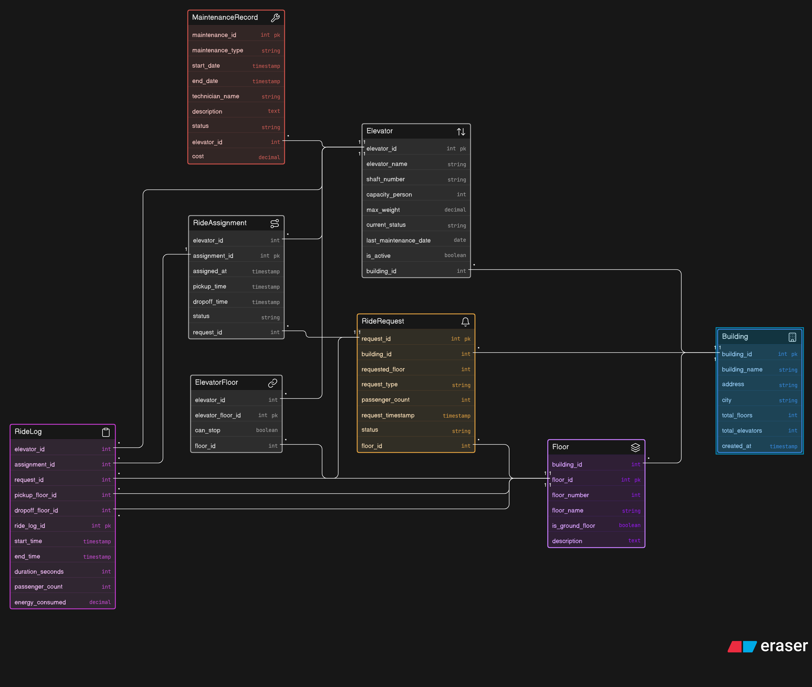

# Smart Elevator Control System - ER Diagram

## ER Diagram



# Smart Elevator Control System – ER Diagram

## Project Overview

The **Smart Elevator Control System** is a database design project that models the working of an intelligent elevator management system used in residential buildings, offices, hospitals, malls, and smart infrastructure environments.

This project focuses on designing an **Entity Relationship (ER) Diagram** that represents the interaction between elevators, floors, users, requests, sensors, maintenance teams, and control systems. The ER diagram helps in understanding how data is stored, managed, and connected inside a smart elevator ecosystem.

The system is designed to improve:

* Elevator efficiency
* Passenger management
* Request scheduling
* Maintenance tracking
* Safety monitoring
* Real-time control operations

---

# Objectives

* Design a structured ER diagram for a smart elevator system
* Represent relationships between elevators, floors, users, and requests
* Manage elevator scheduling and movement tracking
* Store maintenance and sensor information
* Improve system scalability and reliability

---

# Features

## Elevator Management

* Track multiple elevators in a building
* Store elevator status (moving, idle, maintenance)
* Manage elevator capacity and speed

## Floor Management

* Maintain floor information
* Track floor requests
* Handle up/down movement requests

## User Request Handling

* Store passenger requests
* Assign elevators based on availability
* Manage request priority

## Sensor Monitoring

* Door status monitoring
* Weight sensor tracking
* Emergency detection

## Maintenance Tracking

* Schedule maintenance records
* Store technician details
* Track elevator faults and repairs

## Smart Control Operations

* Optimize elevator movement
* Reduce waiting time
* Improve energy efficiency

---

# Entities Used in ER Diagram

## 1. Elevator

Attributes:

* Elevator_ID
* Capacity
* Current_Floor
* Status
* Speed

## 2. Floor

Attributes:

* Floor_ID
* Floor_Number
* Request_Button_Status

## 3. Passenger/User

Attributes:

* User_ID
* Name
* Request_Time
* Destination_Floor

## 4. Request

Attributes:

* Request_ID
* Source_Floor
* Destination_Floor
* Request_Status
* Timestamp

## 5. Sensor

Attributes:

* Sensor_ID
* Sensor_Type
* Sensor_Status

## 6. Maintenance

Attributes:

* Maintenance_ID
* Elevator_ID
* Technician_Name
* Service_Date
* Issue_Description

## 7. Control System

Attributes:

* Control_ID
* Algorithm_Type
* Response_Time

---

# Relationships

| Entity 1       | Relationship  | Entity 2    |
| -------------- | ------------- | ----------- |
| User           | Generates     | Request     |
| Request        | Assigned To   | Elevator    |
| Elevator       | Stops At      | Floor       |
| Elevator       | Uses          | Sensor      |
| Elevator       | Maintained By | Maintenance |
| Control System | Controls      | Elevator    |

---

# Technologies Used

* ER Diagram Design
* Database Modeling
* DBMS Concepts
* MySQL / PostgreSQL (Optional Implementation)
* Draw.io / Lucidchart / StarUML

---

# ER Diagram

Add your ER Diagram image here.

Example:

```md

```

---

# How to Use

1. Clone the repository

```bash
git clone https://github.com/your-username/smart-elevator-control-system.git
```

2. Open the project folder

```bash
cd smart-elevator-control-system
```

3. View the ER diagram using any image viewer or diagram tool.

---

# Future Enhancements

* AI-based elevator scheduling
* IoT integration for real-time monitoring
* Mobile app support
* Emergency evacuation management
* Energy consumption analytics
* Voice-enabled elevator control

---

# Applications

* Smart Buildings
* Hospitals
* Shopping Malls
* Corporate Offices
* Residential Apartments
* Airports and Metro Stations

---

# Learning Outcomes

Through this project, users can learn:

* ER diagram design
* Database normalization concepts
* Relationship mapping
* Smart system architecture
* DBMS modeling techniques


